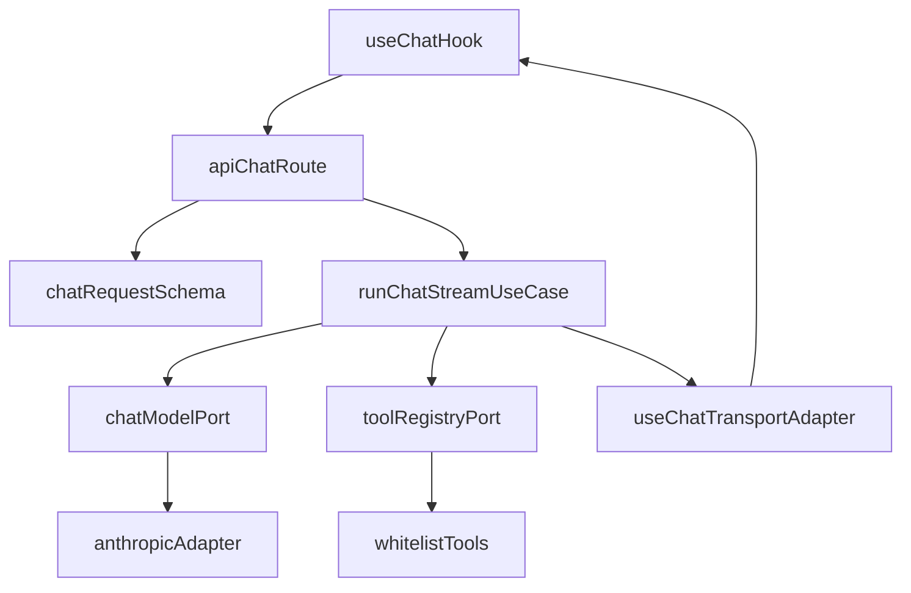

# Anthropic + useChat Backend Plan

## Goal

Create a streaming backend endpoint compatible with Vercel AI `useChat`, using Anthropic with server-side whitelisted tools.

## Architectural Constraints (Locked)

- Apply SOLID by default:
  - SRP: each module has one reason to change.
  - OCP: new tools/providers added via extension, not route rewrites.
  - LSP/ISP: narrow, explicit tool and stream interfaces.
  - DIP: route depends on abstractions (ports), not Anthropic concrete classes directly.
- Follow clean architecture pragmatically:
  - Interface layer: route handler + request/response mapping.
  - Application layer: chat orchestration use case.
  - Infrastructure layer: Anthropic adapter + concrete tool implementations.
- Keep framework specifics (`NextRequest`, `NextResponse`) out of core orchestration logic.

## Scope (Phase 1)

- Add Next.js route handler at [`/Users/lucaspevidor/repos/node/gigablocks-accelerator/main/src/app/api/chat/route.ts`](/Users/lucaspevidor/repos/node/gigablocks-accelerator/main/src/app/api/chat/route.ts).
- Preserve `useChat`-compatible transport contract.
- Support streaming assistant output and server-side whitelisted tool execution.
- Include structured error mapping for transport-safe failures.

## Proposed File Structure

- [`/Users/lucaspevidor/repos/node/gigablocks-accelerator/main/src/app/api/chat/route.ts`](/Users/lucaspevidor/repos/node/gigablocks-accelerator/main/src/app/api/chat/route.ts) — interface layer (HTTP transport + validation + auth gate).
- [`/Users/lucaspevidor/repos/node/gigablocks-accelerator/main/src/lib/ai/application/runChatStream.ts`](/Users/lucaspevidor/repos/node/gigablocks-accelerator/main/src/lib/ai/application/runChatStream.ts) — application use case (model/tool loop).
- [`/Users/lucaspevidor/repos/node/gigablocks-accelerator/main/src/lib/ai/ports/chatModel.ts`](/Users/lucaspevidor/repos/node/gigablocks-accelerator/main/src/lib/ai/ports/chatModel.ts) — model port interface.
- [`/Users/lucaspevidor/repos/node/gigablocks-accelerator/main/src/lib/ai/ports/toolRegistry.ts`](/Users/lucaspevidor/repos/node/gigablocks-accelerator/main/src/lib/ai/ports/toolRegistry.ts) — tool port interface.
- [`/Users/lucaspevidor/repos/node/gigablocks-accelerator/main/src/lib/ai/infrastructure/anthropicChatModel.ts`](/Users/lucaspevidor/repos/node/gigablocks-accelerator/main/src/lib/ai/infrastructure/anthropicChatModel.ts) — Anthropic adapter.
- [`/Users/lucaspevidor/repos/node/gigablocks-accelerator/main/src/lib/ai/infrastructure/toolRegistry.ts`](/Users/lucaspevidor/repos/node/gigablocks-accelerator/main/src/lib/ai/infrastructure/toolRegistry.ts) — whitelist + concrete tools.
- [`/Users/lucaspevidor/repos/node/gigablocks-accelerator/main/src/lib/ai/contracts/chatSchema.ts`](/Users/lucaspevidor/repos/node/gigablocks-accelerator/main/src/lib/ai/contracts/chatSchema.ts) — zod request contract.

## Implementation Steps

1. Define request/response contracts
   - Add `zod` schema for incoming chat payload and optional metadata.
   - Normalize to internal message DTOs independent of transport provider.

2. Create ports (abstractions)
   - Define `ChatModelPort` for streaming + tool-call events.
   - Define `ToolRegistryPort` for discover/execute whitelisted tools.

3. Build Anthropic adapter (infrastructure)
   - Implement `ChatModelPort` using Anthropic SDK streaming.
   - Emit provider-neutral events consumed by application use case.

4. Build tool registry (infrastructure)
   - Register explicit whitelisted tools with input schema + execute function.
   - Reject unknown tools and invalid args deterministically.

5. Implement chat orchestration use case
   - Run model -> tool -> model loop with max-step protection.
   - Keep loop logic framework-agnostic; return stream-friendly event iterator.

6. Add `/api/chat` route (interface layer)
   - Validate request, optionally enforce auth via existing Supabase server client from [`/Users/lucaspevidor/repos/node/gigablocks-accelerator/main/src/lib/supabase/server.ts`](/Users/lucaspevidor/repos/node/gigablocks-accelerator/main/src/lib/supabase/server.ts).
   - Adapt use case stream to `useChat` transport response.

7. Error and resilience policy
   - Map validation/auth/tool/model errors to stable HTTP + body shape.
   - Add max duration / timeout safeguards and safe fallback messages.

## Data Flow

## Verification

- Unit: request schema validation + whitelist enforcement.
- Unit: use case loop stops at configured max steps.
- Integration: `/api/chat` streams text for basic prompt.
- Integration: one whitelisted tool roundtrip streams call + result + final text.
- Manual: lightweight page with `useChat` pointed to `/api/chat`.

## Deliverable

Backend route ready for frontend hook integration, with SOLID-oriented boundaries and clean-architecture layering to keep future provider/tool changes low-risk.
